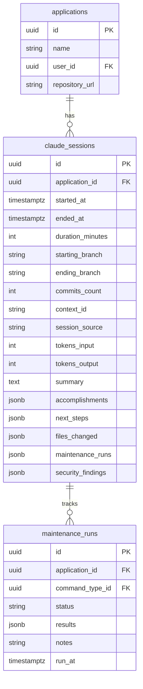
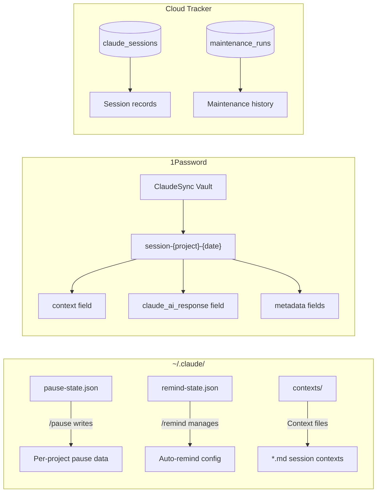
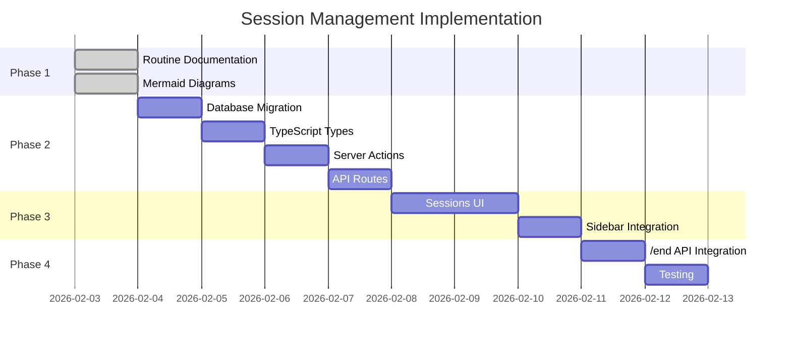

# Session Management Flows

**Freshness:** 2026-02-03T00:00:00Z

## Overview

Visual documentation of session lifecycle, handoff workflows, and Cloud Tracker integration.

---

## Session Lifecycle

```mermaid
flowchart TD
    subgraph "Session Start"
        A[/start] --> B{Branch Check}
        B -->|Match| C[Load Context]
        B -->|Mismatch| D[Fix Branch]
        D --> C
        C --> E{1Password Check}
        E -->|ClaudeSync Found| F[Import claude.ai Response]
        E -->|No ClaudeSync| G[Fresh Start]
        F --> H[Merge Context]
        G --> I[Ready to Work]
        H --> I
    end

    subgraph "Development Work"
        I --> J[Work...]
        J --> K{Break Type?}
    end

    subgraph "Session Pause"
        K -->|Quick Break| L[/pause]
        L --> M[Save WIP Context]
        M --> N[Optional WIP Commit]
        N --> O[Update pause-state.json]
        O --> P[Session Paused]
    end

    subgraph "Session Resume"
        P --> Q[/resume]
        Q --> R[Read pause-state.json]
        R --> S[Load Context File]
        S --> T[Verify Branch]
        T --> I
    end

    subgraph "Session End"
        K -->|Day Done| U[/end]
        U --> V[Proper Commit]
        V --> W[Push to Remote]
        W --> X[Sync to Cloud Tracker]
        X --> Y[Save to 1Password]
        Y --> Z[Session Complete]
    end
```

---

## Handoff Workflow: Claude Code to claude.ai

```mermaid
flowchart TD
    subgraph "Claude Code Session"
        A[/end or /pause --handoff] --> B[Generate Context]
        B --> C[Collect Session Data]
        C --> D[Format Transfer Prompt]
    end

    subgraph "1Password ClaudeSync"
        D --> E[Create ClaudeSync Item]
        E --> F[context field<br/>Full session context]
        E --> G[claude_ai_response field<br/>Empty placeholder]
        E --> H[metadata fields<br/>project, branch, timestamp]
    end

    subgraph "Manual Transfer"
        F --> I[Copy context to clipboard]
        I --> J[Open claude.ai]
        J --> K[Paste into conversation]
    end

    subgraph "claude.ai Session"
        K --> L[claude.ai processes context]
        L --> M[Work continues...]
        M --> N[Request summary for return]
        N --> O[Copy response]
    end

    subgraph "Return to Claude Code"
        O --> P[Paste into 1Password<br/>claude_ai_response field]
        P --> Q[/start in Claude Code]
        Q --> R[Detect ClaudeSync item]
        R --> S[Read claude_ai_response]
        S --> T[Merge insights]
        T --> U[Continue development]
    end
```

---

## Cloud Tracker Integration

```mermaid
flowchart TD
    subgraph "During Session"
        A[Session Start] --> B[Track Session ID]
        B --> C[Work...]
        C --> D{Maintenance Command?}
        D -->|Yes| E[Capture Results]
        E --> F[Store in Session Context]
        F --> C
        D -->|No| C
    end

    subgraph "Session End"
        C --> G[/end]
        G --> H[Collect Session Data]
        H --> I[Build Session Payload]
    end

    subgraph "API Call"
        I --> J[POST /api/sessions]
        J --> K{Auth Valid?}
        K -->|Yes| L[Create Session Record]
        K -->|No| M[Log Error]
        L --> N[Create Maintenance Runs]
        N --> O[Return Session ID]
    end

    subgraph "Cloud Tracker Database"
        L --> P[(claude_sessions)]
        N --> Q[(maintenance_runs)]
        P --> R[Linked to application]
        Q --> S[Linked to session]
    end
```

---

## Session Data Structure



---

## State Files



---

## Command Relationships

```mermaid
flowchart TB
    subgraph "Session Commands"
        A[/start] --> B[/pause]
        B --> C[/resume]
        C --> D[/end]
        D -.-> A
    end

    subgraph "State Management"
        A --> E[Reads pause-state.json]
        A --> F[Checks 1Password]
        B --> G[Writes pause-state.json]
        B --> H[Writes context file]
        C --> I[Reads pause-state.json]
        C --> J[Loads context file]
        D --> K[Syncs to Cloud Tracker]
        D --> L[Writes to 1Password]
    end

    subgraph "Integration Points"
        K --> M[Cloud Tracker API]
        L --> N[1Password ClaudeSync]
        F --> N
    end
```

---

## Decision Points

### Branch Mismatch on /start

```mermaid
flowchart TD
    A[/start] --> B{pause-state exists?}
    B -->|No| C[Fresh session]
    B -->|Yes| D{Branch matches?}
    D -->|Yes| E[Load context]
    D -->|No| F[Show warning]
    F --> G{User decision}
    G -->|Switch branch| H[git checkout paused_branch]
    G -->|Stay on current| I[Clear pause state]
    G -->|Cancel| J[Exit]
    H --> E
    I --> C
```

### Handoff Decision on /end

```mermaid
flowchart TD
    A[/end] --> B{Continuing later?}
    B -->|Same machine| C[Standard end]
    B -->|Different context| D{Where continuing?}
    D -->|claude.ai| E[/end --handoff]
    D -->|Different machine| F[/end --sync]
    E --> G[Create ClaudeSync item]
    F --> H[Push + sync context]
    C --> I[Commit + push only]
```

---

## Integration Timeline



---

## Key Files

| File | Purpose |
|------|---------|
| `~/.claude/commands/start.md` | Session initialization command |
| `~/.claude/commands/end.md` | Session cleanup command |
| `~/.claude/commands/pause.md` | Quick pause command |
| `~/.claude/commands/resume.md` | Resume paused session |
| `~/.claude/routines/handoff.json` | Handoff routine config |
| `~/.claude/pause-state.json` | Global pause state |
| `~/.claude/contexts/*.md` | Session context files |

---

## Related Documentation

- [Session Lifecycle](../docs/SESSION-LIFECYCLE.md)
- [Handoff Protocol](../skills/session-handoff/protocol.md)
- [Cloud Tracker Sessions API](https://apps.jbcloud.app/api/sessions)
